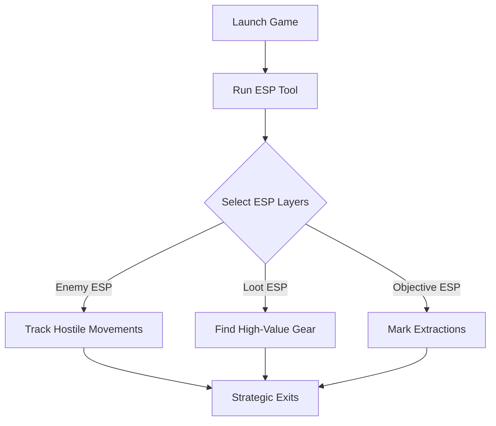

# Arena Breakout: Infinite ESP Tool 👁

The **Arena Breakout: Infinite ESP Tool** is built for players who want unmatched battlefield intelligence. By displaying **real-time overlays** of enemies, loot crates, and objectives, it removes the element of surprise and ensures you always know what’s around the corner.

Instead of pure combat boosts, ESP enhances **awareness and strategy**, making it ideal for practice runs, sandbox testing, or offline exploration.

---

## 📖 Overview

In *Arena Breakout: Infinite*, danger lurks everywhere—hidden snipers, loot-packed rooms, or extraction points just out of sight. The ESP Tool gives you the ability to **see through walls, track enemy movements, and locate valuable items** so you can plan raids with precision.

[!WARNING]
For **offline/custom use only**. Using ESP in online PvP sessions may lead to bans.

---

## 🛠 Features

* **Enemy ESP** – Highlights NPCs and players through terrain and walls.
* **Loot ESP 🎒** – Markers for ammo crates, medkits, and rare drops.
* **Objective ESP 🎯** – Always know extraction zones and key mission points.
* **Ally ESP** – Distinguish friendly squadmates with custom colors.
* **Distance Markers** – Measure range to enemies, loot, or exits.
* **Configurable Colors** – Fully adjustable RGB overlays for clarity.
* **Hotkey Toggle System** – Quickly enable/disable ESP layers with F1–F6.

---

## 💻 Compatibility

| Platform       | Status         | Notes                            |
| -------------- | -------------- | -------------------------------- |
| Windows 10/11  | ✅ Full Support | Steam build confirmed            |
| Steam Deck     | ⚠️ Partial     | Requires Proton overlay tweaks   |
| Linux (Proton) | ⚠️ Partial     | ESP layers may vary in rendering |
| Consoles       | ❌ Unsupported  | PC-exclusive ESP overlay         |

[!NOTE]
Best performance is achieved when the game is run in **DirectX 12 mode**.

---

## ⚡ Setup Guide

1. **Download & extract** the ESP package.
2. Launch *Arena Breakout: Infinite*.
3. Run `ABInfinite_ESP.exe` as Administrator.
4. Open overlay with `Insert`.
5. Adjust settings in `esp.ini` for custom colors and distances.

```ini
[ESPConfig]
EnemyColor=255,0,0
AllyColor=0,0,255
LootColor=0,255,0
ObjectiveColor=255,255,0
MaxDistance=4000
ToggleKey=F1
```

---

## 📊 ESP Workflow Diagram



---

## ❓ FAQ

**Q: Does ESP work for both AI and players?**
A: Yes, with distinct color-coded outlines for easy identification.

**Q: Can I disable certain ESP layers?**
A: Absolutely—toggle enemies, loot, or objectives independently.

**Q: Is this tool heavy on performance?**
A: No, it’s optimized for smooth FPS even on mid-tier PCs.

**Q: Is it safe for multiplayer?**
A: No—ESP should only be used offline or in custom lobbies.

**Q: How often is it updated?**
A: Regular updates ensure compatibility with the latest game patches.

---

## 🎯 Final Thoughts

The **Arena Breakout: Infinite ESP Tool** gives players **perfect situational awareness**, making every raid smarter and more controlled. From loot detection to enemy tracking, it transforms survival into strategy.

---
